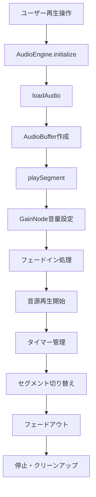

# 🔧 Nocturne MVP - 技術仕様書

## システム概要

### アーキテクチャ
```
Frontend (Next.js)     Backend (FastAPI)     Database (SQLite)
     ↓                        ↓                      ↓
localhost:3000  →  REST API → localhost:8000  →  nocturne.db
```

### 技術スタック
| レイヤー | 技術 | バージョン | 用途 |
|---------|------|-----------|------|
| Frontend | Next.js | 14.2.32 | React フレームワーク |
| Frontend | TypeScript | 5.0+ | 型安全性 |
| Frontend | Tailwind CSS | 3.0+ | スタイリング |
| Frontend | shadcn/ui | Latest | UIコンポーネント |
| Backend | FastAPI | Latest | REST API |
| Backend | SQLAlchemy | Latest | ORM |
| Backend | SQLite | 3.0+ | データベース |
| Audio | Web Audio API | Native | 音声制御 |

## 📁 ディレクトリ構造

```
nocturne/
├── backend/
│   ├── app/
│   │   ├── api/v1/          # REST API エンドポイント
│   │   ├── core/            # 設定・共通機能
│   │   ├── db/              # データベース接続
│   │   ├── models/          # SQLAlchemyモデル
│   │   ├── schemas/         # Pydantic スキーマ
│   │   └── main.py          # FastAPI アプリケーション
│   ├── venv/                # Python仮想環境
│   └── init_db.py           # DB初期化スクリプト
├── frontend/
│   ├── src/
│   │   ├── app/             # Next.js App Router
│   │   ├── components/      # Reactコンポーネント
│   │   │   ├── ui/          # shadcn/ui コンポーネント
│   │   │   └── JourneyPlayer.tsx
│   │   └── lib/             # ユーティリティ
│   │       ├── api.ts       # API クライアント
│   │       ├── audio.ts     # AudioEngine
│   │       └── utils.ts     # 共通関数
│   ├── public/
│   │   └── audio/           # 音源ファイル
│   └── package.json
└── docs/                    # ドキュメント
```

## 🗄️ データベーススキーマ

### journeys テーブル
```sql
CREATE TABLE journeys (
    id INTEGER PRIMARY KEY,
    title VARCHAR(200) NOT NULL,
    description TEXT,
    duration_sec INTEGER NOT NULL,
    thumbnail_url VARCHAR(500),
    category VARCHAR(50),
    created_at DATETIME,
    updated_at DATETIME,
    play_count INTEGER DEFAULT 0,
    rating FLOAT DEFAULT 0
);
```

### segments テーブル
```sql
CREATE TABLE segments (
    id INTEGER PRIMARY KEY,
    journey_id INTEGER NOT NULL,
    time_sec INTEGER NOT NULL,
    "order" INTEGER NOT NULL,
    type VARCHAR(20) NOT NULL,  -- NARRATION, MUSIC, SFX, ACTION
    content JSON NOT NULL,
    duration_sec INTEGER,
    fade_in_sec FLOAT DEFAULT 0,
    fade_out_sec FLOAT DEFAULT 0,
    FOREIGN KEY (journey_id) REFERENCES journeys(id)
);
```

### audio_files テーブル
```sql
CREATE TABLE audio_files (
    id INTEGER PRIMARY KEY,
    filename VARCHAR(255) UNIQUE NOT NULL,
    display_name VARCHAR(200) NOT NULL,
    category VARCHAR(20) NOT NULL,  -- NATURE, MUSIC, VOICE, SFX
    duration_sec INTEGER,
    file_size_mb FLOAT,
    tags JSON,
    license VARCHAR(50),
    source VARCHAR(200),
    bpm INTEGER,
    "key" VARCHAR(10),
    created_at DATETIME,
    play_count INTEGER DEFAULT 0
);
```

## 🔌 API エンドポイント

### Base URL: `http://localhost:8000/api/v1`

#### Journeys API
```http
GET /journeys/                    # ジャーニー一覧
GET /journeys/{id}               # ジャーニー詳細（セグメント含む）
GET /journeys/featured           # おすすめジャーニー
GET /journeys/categories         # カテゴリ一覧
```

#### Audio API  
```http
GET /audio/                      # 音源一覧
GET /audio/{id}                  # 音源詳細
```

#### Health Check
```http
GET /                           # システム情報
GET /health                     # ヘルスチェック
```

### レスポンス例

#### GET /journeys/1
```json
{
  "id": 1,
  "title": "森と川のせせらぎ",
  "description": "深い森の中を流れる川のせせらぎ...",
  "duration_sec": 1800,
  "category": "nature",
  "rating": 4.8,
  "segments": [
    {
      "id": 1,
      "order": 0,
      "type": "narration",
      "content": {
        "text": "ゆっくりと目を閉じて..."
      },
      "duration_sec": 10,
      "fade_in_sec": 0.0,
      "fade_out_sec": 0.0
    },
    {
      "id": 2,
      "order": 1,
      "type": "sfx",
      "content": {
        "audio_url": "forest.mp3",
        "gain": 0.3,
        "loop": true
      },
      "fade_in_sec": 3.0,
      "fade_out_sec": 0.0
    }
  ]
}
```

## 🎵 AudioEngine 仕様

### クラス構造
```typescript
class AudioEngine {
  private audioContext: AudioContext
  private audioBuffers: Map<string, AudioBuffer>
  private currentSource: AudioBufferSourceNode | null
  private gainNode: GainNode | null
  
  // メソッド
  async initialize(): Promise<void>
  async loadAudio(audioFile: string): Promise<AudioBuffer>
  async playSegment(segment: AudioSegment): Promise<void>
  async stop(): Promise<void>
  async pause(): Promise<void>
  setVolume(volume: number): void
  fadeIn(duration: number): Promise<void>
  fadeOut(duration: number): Promise<void>
}
```

### 音源制御フロー


## 🎨 UI/UX 設計

### カラーパレット (Tailwind設定)
```css
nocturne: {
  night: "#0f1419",      /* 夜の闇 */
  moon: "#4a5568",       /* 月明かりのグレー */
  star: "#e2e8f0",       /* 柔らかい星明かり */
  dream: "#805ad5",      /* 夢見る紫 */
  deep: "#1e3a5f",       /* 深い夜空の青 */
}
```

### コンポーネント階層
```
HomePage
├── HeroSection
├── FeaturedJourneys
│   └── JourneyCard[]
└── AllJourneys
    └── JourneyCard[]

JourneyPlayer (Modal)
├── JourneyInfo
├── ProgressBar  
├── TimerControls
├── VolumeControls
└── PlaybackControls
```

## ⚡ パフォーマンス指標

### 目標値
- **初回ロード**: < 2秒
- **音源読み込み**: < 1秒  
- **API応答**: < 100ms
- **UI応答性**: < 16ms (60fps)

### 最適化施策
1. **音源ファイル**
   - MP3 32kbps (単音テスト用)
   - AudioBuffer キャッシュ
   - 遅延読み込み

2. **フロントエンド**
   - Next.js App Router
   - 動的インポート
   - 画像最適化

3. **バックエンド**
   - SQLite + SQLAlchemy
   - 接続プーリング
   - レスポンスキャッシュ

## 🔒 セキュリティ

### 実装済み
- CORS設定（localhost:3000のみ許可）
- SQLAlchemy SQL インジェクション対策
- TypeScript型安全性

### 今後実装予定
- JWT認証
- rate limiting  
- HTTPS強制
- CSP (Content Security Policy)

## 🧪 テスト戦略

### 現在のテスト状況
```bash
# ESLint + TypeScript
cd frontend && npm run lint
cd frontend && npx tsc --noEmit

# 手動テスト
curl http://localhost:8000/api/v1/journeys/
```

### 今後のテスト拡張
- Jest単体テスト
- Playwright E2Eテスト  
- pytest バックエンドテスト
- Lighthouse パフォーマンステスト

## 🚀 デプロイ戦略

### 開発環境
- Frontend: `npm run dev` (localhost:3000)
- Backend: `uvicorn --reload` (localhost:8000)

### 本番環境（案）
- Frontend: Vercel / Netlify
- Backend: Railway / Heroku
- Database: PostgreSQL / Supabase  
- CDN: Cloudflare

## 📝 設定ファイル

### frontend/next.config.mjs
```javascript
/** @type {import('next').NextConfig} */
const nextConfig = {
  env: {
    NEXT_PUBLIC_API_URL: process.env.NEXT_PUBLIC_API_URL || 'http://localhost:8000'
  }
}
export default nextConfig
```

### backend/app/core/config.py
```python
class Settings(BaseSettings):
    PROJECT_NAME: str = "Nocturne"
    VERSION: str = "1.0.0"
    DATABASE_URL: str = "sqlite:///./database.db"
    CORS_ORIGINS: str = "http://localhost:3000"
```

---

**更新履歴**
- 2025-09-07: 初版作成（MVP完成時点）
- 2025-09-07: AudioEngine詳細追加